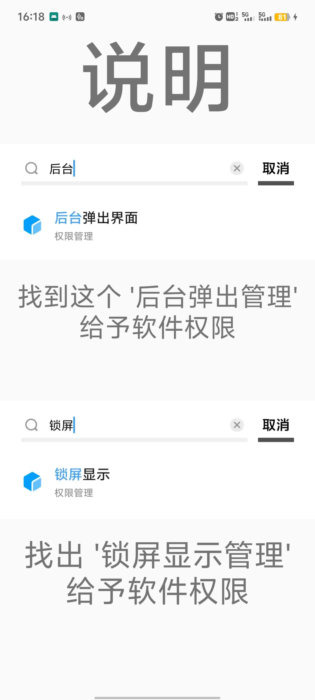
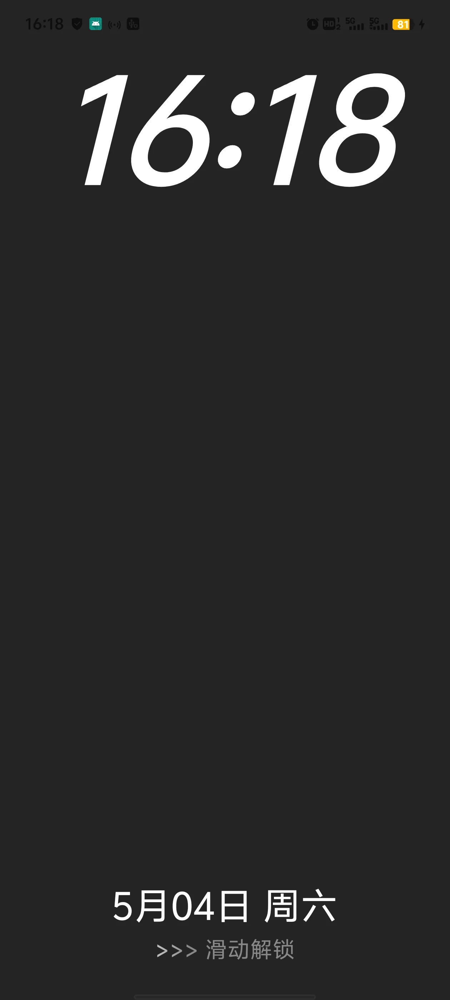
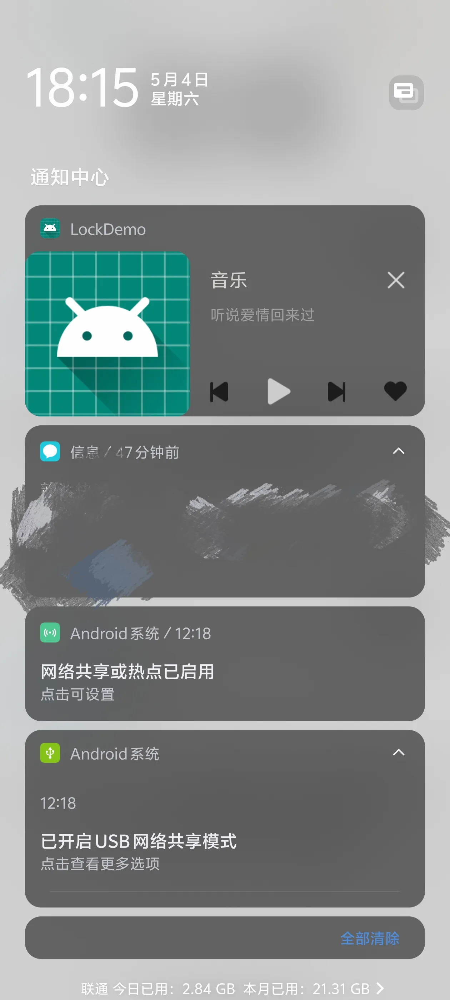
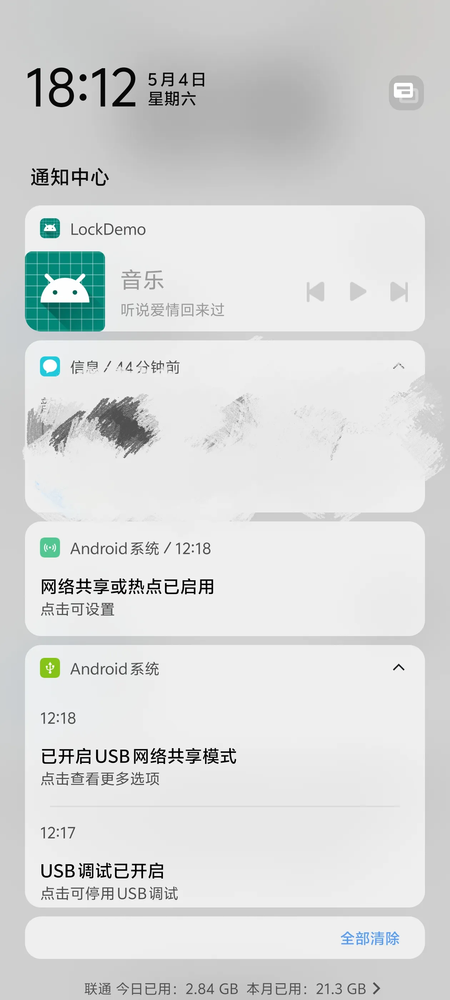
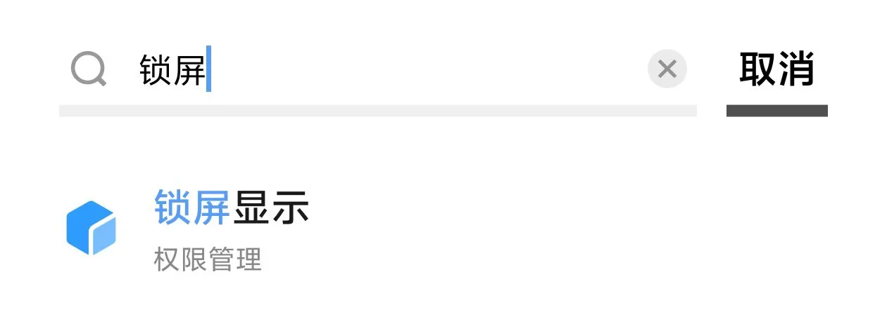
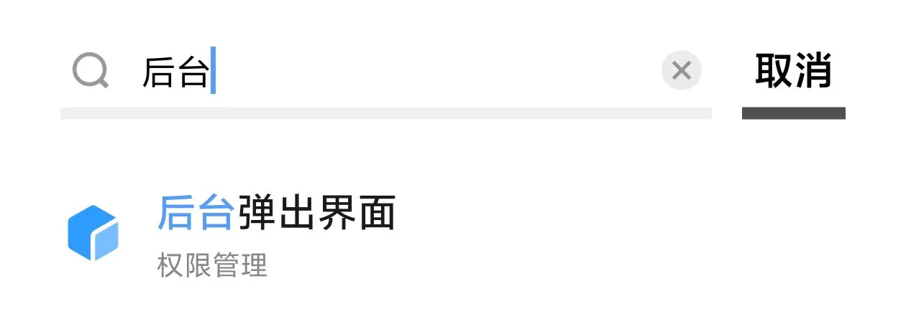
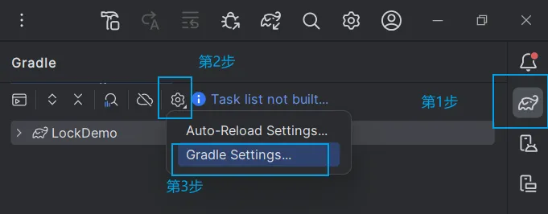
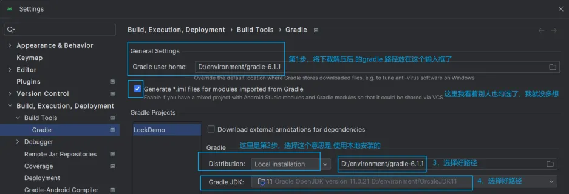

> 这是我clone学习的第一个Android程序，描述的很繁杂
> <br>由于记不住github password，只能使用上传压缩包的形式而分享修改后的代码，见`Releases`
> <br>虽然这个clone仓库 根目录下LockDemo.zip也是修改后的源代码

## 资料：
   - [clone的是这个GitHub上开源的Android项目](https://github.com/still-soul/LockDemo.git)，
   - [也可以看看 阿里 在 语雀app 上提供的一份讲解](https://www.yuque.com/antfe/featured/fc36a0ngy28g1982),
   - [由于图片加载不出，到gitee上看看`/chuanglang/lockdome-README`吧](https://gitee.com/chuanglang/lockdome#https://gitee.com/link?target=https%3A%2F%2Fwww.yuque.com%2Fantfe%2Ffeatured%2Ffc36a0ngy28g1982)

## 效果描述：
   - 息屏后按下电源键 会先拉起 展示海报界面。用户手机息屏后 不用重新解锁进入到app页面，提升使用体验
   - 打开程序 有消息推送效果（大小通知效果都有，通知对黑色模式进行了适配
   - 但奇怪的是 miui13的手机 有锁屏通知效果，originos4没有锁屏通知效果）

## 修改后效果图
   | 打开程序界面告诉你，需要提供权限，见`/img/873183982.jpg`| 给予程序权限后，锁屏页面效果，见 `img/873183944.jpg` |
   | --------------------------------------- | ---------------------------- |
   |  |  |
   |  |  |

## 通过设置为程序`提供`所需要的`权限` 

   - 设置权限需求见： `/img/spxs2.jpg`  和  `/img/httc2.jpg`
   - 
   - 

## **Android 项目导入**： 简单版：
   - 替换`APP`下的`build.gradlle`
   - `project`下的`build.gradle`
   - 将`setting.gradle`替换为本地的可执行语句
  
## **新手学习理解版：**
   - 前提自己会使用电脑创建一个Hello World项目, 并能运行
   - 在[gradle官网](https://gradle.org/releases/)下载，例如：[下载gradle6.1.1](https://gradle.org/next-steps/?version=6.1.1&format=all)，并解压
   - 使用电脑搜索框，搜索'env' ，打开环境变量编辑 写入 如下内容：
     ```
     GRADLE_USER_HOME
     D:\environment\gradle-6.1.1
     ```
     
     
1. clone 一个项目到本地：例如我clone到这个路径下"D:\code\FLUTTERCODE\LockDemo\", 
    <br>&nbsp;&nbsp;&nbsp;&nbsp;&nbsp;正常情况会开始下载东西，当出现一个100多mb的东西时，关闭下载，反正下好了也运行不了

2. 打开"LockDemo\gradle\wrapper\gradle-wrapper.properties" 文件 对一个语句进行注释：
   ```
      大概是第五行，按下这两个键：ctrl / 对这个语句进行注释
      # distributionUrl=https\://services.gradle.org/distributions/gradle-5.4.1-all.zip
   ```

3. 打开'LockDemo/build.gradle' 对语句进行注释
   ```
   例如：在我刚clone下来的项目中 第 9 和 10 行，是这样的
   dependencies {
       classpath 'com.android.tools.build:gradle:3.5.3'

   修改的内容 只是这一句，别把第9行删了，这个是gradle插件，不同于上述的gradle包
       classpath 'com.android.tools.build:gradle:4.0.1'

        // NOTE: Do not place your application dependencies here; they belong
        // in the individual module build.gradle files
   ```

   
5. "\LockDemo\app\build.gradle" 这个文件的语句 我理解为引用插件
```
dependencies {
    implementation fileTree(dir: 'libs', include: ['*.jar'])
    implementation 'androidx.appcompat:appcompat:1.1.0'
    implementation 'androidx.constraintlayout:constraintlayout:1.1.3'
    testImplementation 'junit:junit:4.12'
    androidTestImplementation 'androidx.test:runner:1.2.0'
    androidTestImplementation 'androidx.test.espresso:espresso-core:3.2.0'
}
```

5. 按照如图所示步骤
   - 
   - 
   - 
  
#### OK，照这个步骤基本可以运行clone的项目了
   
   - 但巨大的缺点一：只能运行国人写的安卓项目，无法运行外国人写的，感觉原因是字符集的报错
   - 缺点二：举例说，当前clone的项目使用gradle版本是5.4.1，
     <br>使用本地的gradle6.1.1，版本区别不大，
     <br>但使用高版本gradle就不能行了，一个原因是：gradle 与 Java版本不能拉开太大差距
